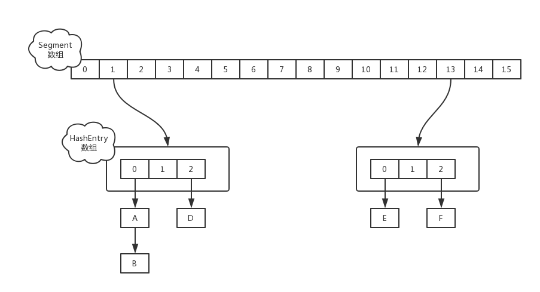

[toc]

# JDK1.7

## 结构

ConcurrentHashMap它采**锁分段技术** 来保证高效的并发操作。ConcurrentHashMap把容器分为多个 **segment（片段）** ，每个片段有一把锁，当多线程访问容器里不同数据段的数据时，线程间就不会存在竞争关系；一个线程占用锁访问一个segment的数据时，并不影响另外的线程访问其他segment中的数据。Segment 继承自 `ReentrantLock`，那本身也就是锁了。结构图如下。



## 源码分析[^6] [^5]

### 重要参数

```java
//ConcurrentHashMap最大容量
static final int MAXIMUM_CAPACITY = 1 << 30;
static final int DEFAULT_INITIAL_CAPACITY = 16;
//默认负载
static final float DEFAULT_LOAD_FACTOR = 0.75f;
//默认并发度，默认最多能有16个线程进行操作
static final int DEFAULT_CONCURRENCY_LEVEL = 16;
//每个段(Segment)中的键值对(Entry)默认有2个
static final int MIN_SEGMENT_TABLE_CAPACITY = 2;
//ConcurrentHashMap最多有1<<16个段
static final int MAX_SEGMENTS = 1 << 16; // slightly conservative

/**
 * Number of unsynchronized retries in size and containsValue
 * methods before resorting to locking. This is used to avoid
 * unbounded retries if tables undergo continuous modification
 * which would make it impossible to obtain an accurate result.
 */
static final int RETRIES_BEFORE_LOCK = 2;

/* ---------------- Fields -------------- */

/**
 * Mask value for indexing into segments. The upper bits of a
 * key's hash code are used to choose the segment.
 */
final int segmentMask;

/**
 * Shift value for indexing within segments.
 */
final int segmentShift;

/**
 * The segments, each of which is a specialized hash table.
 */
final Segment<K,V>[] segments;
```


### 构造函数

构造函数的作用，以构造函数传入的`initialCapacity` 和 `concurrencyLevel`，确认Segment数组的大小`ssize`和每个Segment中HashEntry数组的大小`cap`。其中`ssize`和`cap`向上取整为2的次幂。

```java
@SuppressWarnings("unchecked")
public ConcurrentHashMap(int initialCapacity,
                            float loadFactor, int concurrencyLevel) {
    if (!(loadFactor > 0) || initialCapacity < 0 || concurrencyLevel <= 0)
        throw new IllegalArgumentException();
    if (concurrencyLevel > MAX_SEGMENTS)
        concurrencyLevel = MAX_SEGMENTS;
    // Find power-of-two sizes best matching arguments
    int sshift = 0;
    int ssize = 1;
    //ssize为concurrencyLevel向上取整的2次幂
    while (ssize < concurrencyLevel) {
        ++sshift;
        ssize <<= 1;
    }
    this.segmentShift = 32 - sshift;
    this.segmentMask = ssize - 1;
    if (initialCapacity > MAXIMUM_CAPACITY)
        initialCapacity = MAXIMUM_CAPACITY;
    int c = initialCapacity / ssize;
    if (c * ssize < initialCapacity)
        ++c;
    int cap = MIN_SEGMENT_TABLE_CAPACITY;
    //cap为每个Segment中包含的HashEntry的个数c向上取整为2次幂
    while (cap < c)
        cap <<= 1;
    // create segments and segments[0]
    Segment<K,V> s0 =
        new Segment<K,V>(loadFactor, (int)(cap * loadFactor),
                            (HashEntry<K,V>[])new HashEntry[cap]);
    Segment<K,V>[] ss = (Segment<K,V>[])new Segment[ssize];
    UNSAFE.putOrderedObject(ss, SBASE, s0); // ordered write of segments[0]
    this.segments = ss;
}
```

### `put`方法

操作`ConcurrentHashMap`中元素分为两个步骤：

1. 定位到Segment
2. 调用Segment内部类中的方法，完成对元素的操作

以`put`方法做解释，`remove`,`replace`,`get`方法的操作类似

`ConcurrentHashMap`中的`put`方法

```java
@SuppressWarnings("unchecked")
public V put(K key, V value) {
    Segment<K,V> s;
    if (value == null)
        throw new NullPointerException();
    //计算Hash值
    int hash = hash(key.hashCode());
    //确定Segment数组的下标，定位属于哪个Segment
    int j = (hash >>> segmentShift) & segmentMask;
    if ((s = (Segment<K,V>)UNSAFE.getObject          // nonvolatile; recheck
            (segments, (j << SSHIFT) + SBASE)) == null) //  in ensureSegment
        //获取Segment元素，如果元素不存在，重新创建一个元素
        s = ensureSegment(j);
    return s.put(key, hash, value, false);
}
```

`Segment`中的`put`方法

```java
final V put(K key, int hash, V value, boolean onlyIfAbsent) {
    /**
    * tryLock尝试获取锁。如果获取失败，使用scanAndLockForPut获取锁。
    * scanAndLockForPut除了获取锁，还会遍历链表查找包含给定key的结点。
    * 如果没有找到，则会new一个包含给定key的结点，并返回。
    * 如果找到给定key的结点，返回null。
    * scanfAndLockForPut尝试超过3次CAS加锁失败，则会强制加锁。
    */
    HashEntry<K,V> node = tryLock() ? null :
        scanAndLockForPut(key, hash, value);
    V oldValue;
    try {
        HashEntry<K,V>[] tab = table;
        // 取Segment地址
        int index = (tab.length - 1) & hash;
        // 取链表的头节点
        HashEntry<K,V> first = entryAt(tab, index);
        // 遍历链表
        for (HashEntry<K,V> e = first;;) {
            // 链表中的非空元素
            if (e != null) {
                K k;
                // 存在相同的元素，覆盖
                if ((k = e.key) == key ||
                    (e.hash == hash && key.equals(k))) {
                    oldValue = e.value;
                    if (!onlyIfAbsent) {
                        e.value = value;
                        ++modCount;
                    }
                    break;
                }
                e = e.next;
            }
            // 链表为空，或者链表中不存在待插入的元素
            else {
                // tryLock加锁失败，使用scanAndLockForPut加锁，待插入结点已经初始化，使用头插法插入待插入结点
                if (node != null)
                    node.setNext(first);
                else
                // tryLock加锁成功，待插入结点未初始化，头插法加入结点
                    node = new HashEntry<K,V>(hash, key, value, first);
                int c = count + 1;
                // 超出最大容量，rehash容量扩大两倍
                if (c > threshold && tab.length < MAXIMUM_CAPACITY)
                    rehash(node);
                else
                    setEntryAt(tab, index, node);
                ++modCount;
                count = c;
                // 释放
                oldValue = null;
                break;
            }
        }
    } finally {
        unlock();
    }
    return oldValue;
}
```

```java
private HashEntry<K,V> scanAndLockForPut(K key, int hash, V value) {
    // 链表头节点
    HashEntry<K,V> first = entryForHash(this, hash);
    HashEntry<K,V> e = first;
    HashEntry<K,V> node = null;
    int retries = -1; // negative while locating node
    while (!tryLock()) {
        HashEntry<K,V> f; // to recheck first below
        if (retries < 0) {
            // 链表为空
            if (e == null) {
                // 待插入结点未初始化
                if (node == null) // speculatively create node
                    node = new HashEntry<K,V>(hash, key, value, null);
                // retries+=1
                retries = 0;
            }
            // 找到包含给定key的元素
            else if (key.equals(e.key))
                // retries+=1
                retries = 0;
            else
                e = e.next;
        }
        // 尝试3次CAS获取锁，失败，整个segment强制加锁
        else if (++retries > MAX_SCAN_RETRIES) {
            lock();
            break;
        }
        // 获取锁过程中，链表被修改，重置retries=-1，重置头节点first=f，重新遍历链表，重新尝试获取锁
        else if ((retries & 1) == 0 &&
                    (f = entryForHash(this, hash)) != first) {
            e = first = f; // re-traverse if entry changed
            retries = -1;
        }
    }
    return node;
}
```


### `rehash`方法

将Segment中的table容量扩大两倍，并将Segment中的结点重新分配。

```java
@SuppressWarnings("unchecked")
private void rehash(HashEntry<K,V> node) {
   /*
    * Reclassify nodes in each list to new table.  Because we
    * are using power-of-two expansion, the elements from
    * each bin must either stay at same index, or move with a
    * power of two offset. We eliminate unnecessary node
    * creation by catching cases where old nodes can be
    * reused because their next fields won't change.
    * Statistically, at the default threshold, only about
    * one-sixth of them need cloning when a table
    * doubles. The nodes they replace will be garbage
    * collectable as soon as they are no longer referenced by
    * any reader thread that may be in the midst of
    * concurrently traversing table. Entry accesses use plain
    * array indexing because they are followed by volatile
    * table write.
    */
    HashEntry<K,V>[] oldTable = table;
    int oldCapacity = oldTable.length;
    int newCapacity = oldCapacity << 1;
    threshold = (int)(newCapacity * loadFactor);
    HashEntry<K,V>[] newTable =
        (HashEntry<K,V>[]) new HashEntry[newCapacity];
    int sizeMask = newCapacity - 1;
    for (int i = 0; i < oldCapacity ; i++) {
        HashEntry<K,V> e = oldTable[i]; //头节点
        if (e != null) {
            HashEntry<K,V> next = e.next;
            int idx = e.hash & sizeMask;
            if (next == null)   //  Single node on list
                newTable[idx] = e;
            // 链表含多个元素，重用同一个slot中的最后一段hash值相同的链表
            else { // Reuse consecutive sequence at same slot
                HashEntry<K,V> lastRun = e; //最后一段链表的头节点
                int lastIdx = idx; // 最后一段链表所映射的hashtable的下标
                for (HashEntry<K,V> last = next;
                        last != null;
                        last = last.next) {
                    int k = last.hash & sizeMask;
                    if (k != lastIdx) {
                        lastIdx = k;
                        lastRun = last;
                    }
                }
                newTable[lastIdx] = lastRun;
                // Clone remaining nodes
                // 重新分配结点，最后一段链表不用重新分配
                for (HashEntry<K,V> p = e; p != lastRun; p = p.next) {
                    V v = p.value;
                    int h = p.hash;
                    int k = h & sizeMask;
                    HashEntry<K,V> n = newTable[k];
                    newTable[k] = new HashEntry<K,V>(h, p.key, v, n);
                }
            }
        }
    }
    int nodeIndex = node.hash & sizeMask; // add the new node
    node.setNext(newTable[nodeIndex]);
    newTable[nodeIndex] = node;
    table = newTable;
}
```

### `size`方法

```java
/**
 * Returns the number of key-value mappings in this map.  If the
 * map contains more than <tt>Integer.MAX_VALUE</tt> elements, returns
 * <tt>Integer.MAX_VALUE</tt>.
 *
 * @return the number of key-value mappings in this map
 */
public int size() {
    // Try a few times to get accurate count. On failure due to
    // continuous async changes in table, resort to locking.
    final Segment<K,V>[] segments = this.segments;
    int size;
    boolean overflow; // true if size overflows 32 bits
    long sum;         // sum of modCounts
    long last = 0L;   // previous sum
    int retries = -1; // first iteration isn't retry
    try {
        for (;;) {
            // 当重试次数等于3次时，直接遍历每个segment并上锁
            if (retries++ == RETRIES_BEFORE_LOCK) {
                for (int j = 0; j < segments.length; ++j)
                    ensureSegment(j).lock(); // force creation
            }
            sum = 0L;
            size = 0;
            overflow = false;
            for (int j = 0; j < segments.length; ++j) {
                Segment<K,V> seg = segmentAt(segments, j);
                if (seg != null) {
                    sum += seg.modCount;
                    int c = seg.count;
                    // 判断是否溢出
                    if (c < 0 || (size += c) < 0)
                        overflow = true;
                }
            }
            if (sum == last)
                break;
            last = sum;
        }
    } finally {
        // 解锁
        if (retries > RETRIES_BEFORE_LOCK) {
            for (int j = 0; j < segments.length; ++j)
                segmentAt(segments, j).unlock();
        }
    }
    return overflow ? Integer.MAX_VALUE : size;
}
```


# JDK1.8 [^7] [^8] [^4]

## 结构


## 源码分析

### 重要参数

```java
/**
 * Table initialization and resizing control.  When negative, the
 * table is being initialized or resized: -1 for initialization,
 * else -(1 + the number of active resizing threads).  Otherwise,
 * when table is null, holds the initial table size to use upon
 * creation, or 0 for default. After initialization, holds the
 * next element count value upon which to resize the table.
 */
// sizeCtl<0，表示table数组正在初始化。sizeCtl=-1，只有一个线程在初始表；sizeCtl<-1，说明有其他线程在等待
// 当在初始化**前**，sizeCtl的值为表的大小
// 当在初始化**后**，sizeCtl的值为进行resize的阈值
private transient volatile int sizeCtl;

/* Upon transfer, the old table bin contains
 * only a special forwarding node (with hash field "MOVED") that
 * contains the next table as its key. On encountering a
 * forwarding node, access and update operations restart, using
 * the new table.
 */ 
// 结点转移过程中，旧的table中只有hash值为MOVED这样一个结点，
// 访问和更新操作访问到一个forwarding node，就将访问操作重定向到新的table中，forwarding node的键为new table
static final int MOVED     = -1; // hash for forwarding nodes

/** Number of CPUS, to place bounds on some sizings */
// 可用的CPU
static final int NCPU = Runtime.getRuntime().availableProcessors();

/**
 * Minimum number of rebinnings per transfer step. Ranges are
 * subdivided to allow multiple resizer threads.  This value
 * serves as a lower bound to avoid resizers encountering
 * excessive memory contention.  The value should be at least
 * DEFAULT_CAPACITY.
 */
private static final int MIN_TRANSFER_STRIDE = 16;

/**
 * The number of bits used for generation stamp in sizeCtl.
 * Must be at least 6 for 32bit arrays.
 */
private static final int RESIZE_STAMP_BITS = 16;

/**
 * The next table index (plus one) to split while resizing.
 */
private transient volatile int transferIndex;

/**
 * The next table to use; non-null only while resizing.
 */
private transient volatile Node<K,V>[] nextTable;
```


### 初始化

#### `ConcurrentHashMap` 方法

构造函数不对数组进行初始化，`ConcurrrentHashMap`的作用是，确定`table`数组的长度。

```java
public ConcurrentHashMap(int initialCapacity,
                            float loadFactor, int concurrencyLevel) {
    // 检查参数
    if (!(loadFactor > 0.0f) || initialCapacity < 0 || concurrencyLevel <= 0)
        throw new IllegalArgumentException();
    // JDK1.8中concurrentLevel和initialCapacity都代表hashtable数组的长度
    if (initialCapacity < concurrencyLevel)   // Use at least as many bins
        initialCapacity = concurrencyLevel;   // as estimated threads
    long size = (long)(1.0 + (long)initialCapacity / loadFactor);
    // 向上取整为2的次幂
    int cap = (size >= (long)MAXIMUM_CAPACITY) ?
        MAXIMUM_CAPACITY : tableSizeFor((int)size);
    this.sizeCtl = cap;
}
```

`ConcurrentHashMap`只有在`put`添加元素时，发现表为空，才会调用`initTable`将数组初始化。

#### `initTable`方法

```java
private final Node<K,V>[] initTable() {
    Node<K,V>[] tab; int sc;
    // 第一次put，table还没有初始化
    while ((tab = table) == null || tab.length == 0) {
        // sizeCtl<0，表明其他的线程正在初始化
        // 获取初始化表的大小sizeCtl，存在sc中
        if ((sc = sizeCtl) < 0)
            Thread.yield(); // lost initialization race; just spin
        // 通过CAS设置，sizeCtl的值为-1，如果失败，则spin
        else if (U.compareAndSetInt(this, SIZECTL, sc, -1)) {
            try {
                // re-check
                if ((tab = table) == null || tab.length == 0) {
                    int n = (sc > 0) ? sc : DEFAULT_CAPACITY;
                    @SuppressWarnings("unchecked")
                    Node<K,V>[] nt = (Node<K,V>[])new Node<?,?>[n];
                    table = tab = nt;
                    // 初始化完成，sc为原来的3/4，恰好为loadFactor
                    sc = n - (n >>> 2);
                }
            } finally {
                // 将阈值设置到sizeCtl中
                sizeCtl = sc;
            }
            break;
        }
    }
    return tab;
}
```

### 添加

#### `put`方法

```java
public V put(K key, V value) {
    // 调用putVal方法
    // onlyIfAbsent设置为false，如果concurrenthashmap中存在键key，更新该键中的值value
	return putVal(key, value, false);
}
```

#### `putVal`方法

```java
final V putVal(K key, V value, boolean onlyIfAbsent) {
    // concurrenthashmap中的键和值都不能为空，这里要和hashmap不同，hashmap允许一个键为null，多个值value为null
    if (key == null || value == null) throw new NullPointerException();
    // 高位16bit和低位16bit异或，并将异或后的最高位置0
    int hash = spread(key.hashCode());
    // 链表中结点的个数
    int binCount = 0;
    // 遍历table
    for (Node<K,V>[] tab = table;;) {
        Node<K,V> f; int n, i, fh; K fk; V fv;
        // table为空，初始化表
        // 将表的长度存入n
        if (tab == null || (n = tab.length) == 0)
            tab = initTable();
        // 头节点为空，直接用CAS将头节点插入到链表头中
        else if ((f = tabAt(tab, i = (n - 1) & hash)) == null) {
            if (casTabAt(tab, i, null, new Node<K,V>(hash, key, value)))
                break;                   // no lock when adding to empty bin
        }
        // 如果检测到某个节点的hash值是MOVED，则表示正在进行数组扩张的数据复制阶段，
        // 则当前线程也会参与去复制，通过允许多线程复制的功能，一次来减少数组的复制所带来的性能损失
        else if ((fh = f.hash) == MOVED)
            tab = helpTransfer(tab, f);
        // 已经存在给定的key，且value非空，设定了onlyIfAbsent=true，不对value进行更新
        else if (onlyIfAbsent // check first node without acquiring lock
                    && fh == hash
                    && ((fk = f.key) == key || (fk != null && key.equals(fk)))
                    && (fv = f.val) != null)
            return fv;
        else {
            V oldVal = null;
            synchronized (f) {
                // 加锁后,re-check
                if (tabAt(tab, i) == f) {
                    // 当前链表或红黑树没有进行转移
                    if (fh >= 0) {
                        binCount = 1;
                        for (Node<K,V> e = f;; ++binCount) {
                            K ek;
                            // 存在给定的key，根据onlyIfAbsent进行更新
                            if (e.hash == hash &&
                                ((ek = e.key) == key ||
                                    (ek != null && key.equals(ek)))) {
                                oldVal = e.val;
                                if (!onlyIfAbsent)
                                    e.val = value;
                                break;
                            }
                            Node<K,V> pred = e;
                            // 遍历到链表末端
                            // 尾插法，插入新的结点
                            // 这里和JDK1.7 不同，JDK1.7结点插入使用头插法
                            if ((e = e.next) == null) {
                                pred.next = new Node<K,V>(hash, key, value);
                                break;
                            }
                        }
                    }
                    // 是红黑树
                    else if (f instanceof TreeBin) {
                        Node<K,V> p;
                        binCount = 2;
                        if ((p = ((TreeBin<K,V>)f).putTreeVal(hash, key,
                                                        value)) != null) {
                            oldVal = p.val;
                            if (!onlyIfAbsent)
                                p.val = value;
                        }
                    }
                    else if (f instanceof ReservationNode)
                        throw new IllegalStateException("Recursive update");
                }
            }
            if (binCount != 0) {
                // 数组长度小于64，且链表长度大于8，对table进行扩容
                // 数组长度大于64，且链表长度大于8，将链表转化为红黑树
                if (binCount >= TREEIFY_THRESHOLD)
                    treeifyBin(tab, i);
                if (oldVal != null)
                    return oldVal;
                break;
            }
        }
    }
    addCount(1L, binCount);
    return null;
}
```

### 扩容

#### `treeifyBin`方法

```java
/**
 * Replaces all linked nodes in bin at given index unless table is
 * too small, in which case resizes instead.
 */
// 当数组长度小于64时，进行数组扩容
// 当数组长度大于64时，将链表转化为红黑树
private final void treeifyBin(Node<K,V>[] tab, int index) {
    Node<K,V> b; int n;
    if (tab != null) {
        // 数组长度小于64，数组进行扩容
        if ((n = tab.length) < MIN_TREEIFY_CAPACITY)
            tryPresize(n << 1);
        // 链表头节点非空，且数组没有在移动
        else if ((b = tabAt(tab, index)) != null && b.hash >= 0) {
            synchronized (b) {
                // recheck
                if (tabAt(tab, index) == b) {
                    TreeNode<K,V> hd = null, tl = null;
                    // 遍历链表
                    for (Node<K,V> e = b; e != null; e = e.next) {
                        // 链表结点转化为头节点
                        TreeNode<K,V> p =
                            new TreeNode<K,V>(e.hash, e.key, e.val,
                                                null, null);
                        // 把Node组成的链表，转化为TreeNode的链表，头结点任然放在相同的位置
                        if ((p.prev = tl) == null)
                            hd = p;
                        else
                            tl.next = p;
                        tl = p;
                    }
                    // 把TreeNode的链表放入容器TreeBin中
                    setTabAt(tab, index, new TreeBin<K,V>(hd));
                }
            }
        }
    }
}
```

#### `tryPresize`方法

```java
/**
 * Tries to presize table to accommodate the given number of elements.
 *
 * @param size number of elements (doesn't need to be perfectly accurate)
 */
private final void tryPresize(int size) {
    // size*1.5，并向上取整为2的次幂
    int c = (size >= (MAXIMUM_CAPACITY >>> 1)) ? MAXIMUM_CAPACITY :
        tableSizeFor(size + (size >>> 1) + 1);
    int sc;
    // 没有其他线程正在扩容
    // sc为扩容的阈值
    while ((sc = sizeCtl) >= 0) {
        Node<K,V>[] tab = table; int n;
        //1.链表为空
        if (tab == null || (n = tab.length) == 0) {
            // 取sc和c的较大者，作为扩容数组的大小
            n = (sc > c) ? sc : c;
            if (U.compareAndSetInt(this, SIZECTL, sc, -1)) {
                try {
                    if (table == tab) {
                        @SuppressWarnings("unchecked")
                        Node<K,V>[] nt = (Node<K,V>[])new Node<?,?>[n];
                        table = nt;
                        // 扩容阈值为0.75*n
                        sc = n - (n >>> 2);
                    }
                } finally {
                    sizeCtl = sc;
                }
            }
        }
        // 扩容后的数组长度未超过扩容阈值，无需进行扩容
        // 扩容后的数组长度超过最大长度，无法扩容
        else if (c <= sc || n >= MAXIMUM_CAPACITY)
            break;
        // 对数组进行扩容
        else if (tab == table) {
            int rs = resizeStamp(n);
            if (U.compareAndSetInt(this, SIZECTL, sc,
                                    (rs << RESIZE_STAMP_SHIFT) + 2))
                transfer(tab, null);
        }
    }
}
```

#### `transfer`方法

```java
/**
 * Moves and/or copies the nodes in each bin to new table. See
 * above for explanation.
 * 把数组中的节点复制到新的数组的相同位置，或者移动到扩张部分的相同位置
 * 在这里首先会计算一个步长，表示一个线程处理的数组长度，用来控制对CPU的使用，
 * 每个CPU最少处理16个长度的数组元素,也就是说，如果一个数组的长度只有16，那只有一个线程会对其进行扩容的复制移动操作
 * 扩容的时候会一直遍历，知道复制完所有节点，没处理一个节点的时候会在链表的头部设置一个fwd节点，这样其他线程就会跳过他，
 * 复制后在新数组中的链表不是绝对的反序的
 */
private final void transfer(Node<K,V>[] tab, Node<K,V>[] nextTab) {
    int n = tab.length, stride;
    // MIN_TRANSFER_STRIDE 用来控制不要占用太多CPU
    if ((stride = (NCPU > 1) ? (n >>> 3) / NCPU : n) < MIN_TRANSFER_STRIDE) 
        stride = MIN_TRANSFER_STRIDE; // subdivide range
   /*
    * 如果复制的目标nextTab为null的话，则初始化一个table两倍长的nextTab
    * 此时nextTable被设置值了(在初始情况下是为null的)
    * 因为如果有一个线程开始了表的扩张的时候，其他线程也会进来帮忙扩张，
    * 而只是第一个开始扩张的线程需要初始化下目标数组
    */
    if (nextTab == null) {            // initiating
        try {
            @SuppressWarnings("unchecked")
            Node<K,V>[] nt = (Node<K,V>[])new Node<?,?>[n << 1];
            nextTab = nt;
        } catch (Throwable ex) {      // try to cope with OOME
            sizeCtl = Integer.MAX_VALUE;
            return;
        }
        nextTable = nextTab;
        transferIndex = n;
    }
    int nextn = nextTab.length;
    /*
     * 创建一个fwd节点，这个是用来控制并发的，当一个节点为空或已经被转移之后，就设置为fwd节点
     * 这是一个空的标志节点
     */
    ForwardingNode<K,V> fwd = new ForwardingNode<K,V>(nextTab);
    // 指示当前bin(数组单元)是否移动完成，advance=true，说明该bin已经移动到新的table中
    boolean advance = true;
    // 指示线程是否已将16个单位全部移动完成
    //  to ensure sweep(清扫) before committing nextTab,在完成之前重新在扫描一遍数组，看看有没完成的没
    boolean finishing = false; // to ensure sweep before committing nextTab
    // 遍历数组，从高位到低位开始遍历，每16个单元分配给一个线程
    // i指示当前处理的bin，bound表示线程移动范围的下界
    for (int i = 0, bound = 0;;) {
        Node<K,V> f; int fh;
        while (advance) {
            // nextIndex是下一轮移动的起始位置，nextBound是下一轮移动的结束位置
            int nextIndex, nextBound;
            // 线程下一个需要移动的bin还在16个移动单元范围内  或者 线程移动已经结束。直接退出while循环开始移动元素
            if (--i >= bound || finishing)
                advance = false;
            // 下一轮移动越界，移动完成
            else if ((nextIndex = transferIndex) <= 0) {
                i = -1;
                advance = false;
            }
            // 线程这一轮的移动已经结束了
            // 使用CAS确定下一轮移动元素的范围
            else if (U.compareAndSetInt
                        (this, TRANSFERINDEX, nextIndex,
                        nextBound = (nextIndex > stride ?
                                    nextIndex - stride : 0))) {
                bound = nextBound;
                i = nextIndex - 1;
                advance = false;
            }
        }
        // 超出了数组的范围
        if (i < 0 || i >= n || i + n >= nextn) {
            int sc;
            if (finishing) {
                // 移动完成，释放nextTable
                nextTable = null;
                table = nextTab;
                // 设置扩容阈值 sizeCtl=0.75*(2*n)=1.5*n
                sizeCtl = (n << 1) - (n >>> 1);
                return;
            }
            if (U.compareAndSetInt(this, SIZECTL, sc = sizeCtl, sc - 1)) {
                if ((sc - 2) != resizeStamp(n) << RESIZE_STAMP_SHIFT)
                    return;
                finishing = advance = true;
                i = n; // recheck before commit
            }
        }
        else if ((f = tabAt(tab, i)) == null)
            advance = casTabAt(tab, i, null, fwd);
        // 已处理，向前移动一个单位
        else if ((fh = f.hash) == MOVED)
            advance = true; // already processed
        else {
            synchronized (f) {
                // recheck,确认加锁过程中是否被修改
                if (tabAt(tab, i) == f) {
                    // ln--lower node，扩容后不需要移动的结点组成一个链表，ln是这个链表的头节点
                    // hn--high node，扩容后需要移动2^n的结点组成一个链表,hn是这个链表的头节点
                    Node<K,V> ln, hn;
                    if (fh >= 0) {
                        int runBit = fh & n;
                        Node<K,V> lastRun = f;
                        // 重用最后一段不需要的移动的结点
                        for (Node<K,V> p = f.next; p != null; p = p.next) {
                            int b = p.hash & n;
                            if (b != runBit) {
                                runBit = b;
                                lastRun = p;
                            }
                        }
                        // 最后一段不需要移动,ln为这段链表的头节点
                        if (runBit == 0) {
                            ln = lastRun;
                            hn = null;
                        }
                        // 最后一段需要移动，hn为这段链表的否接电
                        else {
                            hn = lastRun;
                            ln = null;
                        }
                        // 重新创建结点
                        for (Node<K,V> p = f; p != lastRun; p = p.next) {
                            int ph = p.hash; K pk = p.key; V pv = p.val;
                            if ((ph & n) == 0)
                                ln = new Node<K,V>(ph, pk, pv, ln);
                            else
                                hn = new Node<K,V>(ph, pk, pv, hn);
                        }
                        setTabAt(nextTab, i, ln);
                        setTabAt(nextTab, i + n, hn);
                        // 设置标记结点
                        setTabAt(tab, i, fwd);
                        advance = true;
                    }
                    // bin中的结点为红黑树
                    else if (f instanceof TreeBin) {
                        TreeBin<K,V> t = (TreeBin<K,V>)f;
                        // lo--lower为扩容后不需要移动的结点
                        TreeNode<K,V> lo = null, loTail = null;
                        // hi--higher扩容后，需要移动2^n的结点
                        TreeNode<K,V> hi = null, hiTail = null;
                        // lc--lower count，为lo的结点个数，hc--high count为hi结点的个数
                        int lc = 0, hc = 0;
                        for (Node<K,V> e = t.first; e != null; e = e.next) {
                            int h = e.hash;
                            TreeNode<K,V> p = new TreeNode<K,V>
                                (h, e.key, e.val, null, null);
                            if ((h & n) == 0) {
                                if ((p.prev = loTail) == null)
                                    lo = p;
                                else
                                    loTail.next = p;
                                loTail = p;
                                ++lc;
                            }
                            else {
                                if ((p.prev = hiTail) == null)
                                    hi = p;
                                else
                                    hiTail.next = p;
                                hiTail = p;
                                ++hc;
                            }
                        }
                        // 结点个数小于等于6，将红黑树转化为链表
                        ln = (lc <= UNTREEIFY_THRESHOLD) ? untreeify(lo) :
                            (hc != 0) ? new TreeBin<K,V>(lo) : t;
                        hn = (hc <= UNTREEIFY_THRESHOLD) ? untreeify(hi) :
                            (lc != 0) ? new TreeBin<K,V>(hi) : t;
                        setTabAt(nextTab, i, ln);
                        setTabAt(nextTab, i + n, hn);
                        setTabAt(tab, i, fwd);
                        advance = true;
                    }
                    else if (f instanceof ReservationNode)
                        throw new IllegalStateException("Recursive update");
                }
            }
        }
    }
}
```

### 访问

#### `get`方法

```java
public V get(Object key) {
        Node<K,V>[] tab; Node<K,V> e, p; int n, eh; K ek;
        int h = spread(key.hashCode());
        if ((tab = table) != null && (n = tab.length) > 0 &&
            (e = tabAt(tab, (n - 1) & h)) != null) {
            // bin的头节点就是要查找的key-value键值对
            if ((eh = e.hash) == h) {
                if ((ek = e.key) == key || (ek != null && key.equals(ek)))
                    return e.val;
            }
            // eh<0，说明该bin包含了红黑树
            else if (eh < 0)
                return (p = e.find(h, key)) != null ? p.val : null;
            // 遍历查找
            while ((e = e.next) != null) {
                if (e.hash == h &&
                    ((ek = e.key) == key || (ek != null && key.equals(ek))))
                    return e.val;
            }
        }
        return null;
}
```


### 同步机制

​		前面分析了下ConcurrentHashMap的源码，那么，对于一个映射集合来说，ConcurrentHashMap是如果来做到并发安全，又是如何做到高效的并发的呢？

　　首先是读操作，从源码中可以看出来，在get操作中，根本没有使用同步机制，也没有使用unsafe方法，所以读操作是支持并发操作的。

　　那么写操作呢？

　　分析这个之前，先看看什么情况下会引起数组的扩容，扩容是通过transfer方法来进行的。而调用transfer方法的只有trePresize、helpTransfer和addCount三个方法。

　　这三个方法又是分别在什么情况下进行调用的呢？

+ tryPresize是在treeIfybin和putAll方法中调用，treeIfybin主要是在put添加元素完之后，判断该数组节点相关元素是不是已经超过8个的时候，如果超过则会调用这个方法来扩容数组或者把链表转为树。

+ helpTransfer是在当一个线程要对table中元素进行操作的时候，如果检测到节点的HASH值为MOVED的时候，就会调用helpTransfer方法，在helpTransfer中再调用transfer方法来帮助完成数组的扩容
+ addCount是在当对数组进行操作，使得数组中存储的元素个数发生了变化的时候会调用的方法。

　　

　　**所以引起数组扩容的情况如下**：

+ 只有在往map中添加元素的时候，在某一个节点的数目已经超过了8个，同时数组的长度又小于64的时候，才会触发数组的扩容。

+ 当数组中元素达到了sizeCtl的数量的时候，则会调用transfer方法来进行扩容

　　

　　**那么在扩容的时候，可以不可以对数组进行读写操作呢？**

+ 事实上是可以的。当在进行数组扩容的时候，如果当前节点还没有被处理（也就是说还没有设置为fwd节点），那就可以进行设置操作。

+ 如果该节点已经被处理了，则当前线程也会加入到扩容的操作中去。

　　

　　**那么，多个线程又是如何同步处理的呢？**

+ 在ConcurrentHashMap中，同步处理主要是通过Synchronized和unsafe两种方式来完成的。

+ 在取得sizeCtl、某个位置的Node的时候，使用的都是unsafe的方法，来达到并发安全的目的

+ 当需要在某个位置设置节点的时候，则会通过Synchronized的同步机制来锁定该位置的节点。

+ 在数组扩容的时候，则通过处理的步长和fwd节点来达到并发安全的目的，通过设置hash值为MOVED

+ 当把某个位置的节点复制到扩张后的table的时候，也通过Synchronized的同步机制来保证现程安全

### 红黑树 [[红黑树]]

# 参考资料

[^1]:[谈谈ConcurrentHashMap1.7和1.8的不同实现](https://www.jianshu.com/p/e694f1e868ec)
[^2]:[ConcurrentHashMap底层实现原理((JDK1.7&1.8)) ](https://blog.csdn.net/zhang18024666607/article/details/92796400?ops_request_misc=%257B%2522request%255Fid%2522%253A%2522161248834016780265470911%2522%252C%2522scm%2522%253A%252220140713.130102334..%2522%257D&request_id=161248834016780265470911&biz_id=0&utm_medium=distribute.pc_search_result.none-task-blog-2~all~top_click~default-1-92796400.first_rank_v2_pc_rank_v29_10&utm_term=concurrenthashmap&spm=1018.2226.3001.4187)
[^3]:[ConcurrentHashMap详解](https://blog.csdn.net/fanrenxiang/article/details/80435459?ops_request_misc=&request_id=&biz_id=102&utm_term=concurrenthashmap&utm_medium=distribute.pc_search_result.none-task-blog-2~all~sobaiduweb~default-0-80435459.first_rank_v2_pc_rank_v29_10&spm=1018.2226.3001.4187)
[^4]:[关于jdk1.8中ConcurrentHashMap的方方面面 ](https://blog.csdn.net/tp7309/article/details/76532366?ops_request_misc=%257B%2522request%255Fid%2522%253A%2522161248834016780265470911%2522%252C%2522scm%2522%253A%252220140713.130102334..%2522%257D&request_id=161248834016780265470911&biz_id=0&utm_medium=distribute.pc_search_result.none-task-blog-2~all~sobaiduend~default-3-76532366.first_rank_v2_pc_rank_v29_10&utm_term=concurrenthashmap&spm=1018.2226.3001.4187)
[^5]:[ConcurrentHashMap实现原理及源码分析](https://www.cnblogs.com/chengxiao/p/6842045.html)
[^6]:[JDK 1.7之 ConcurrentHashMap 源码分析](https://blog.csdn.net/crazy1235/article/details/76795383)
[^7]:[ConcurrentHashMap源码分析(1.8)](https://www.cnblogs.com/zerotomax/p/8687425.html)

[^8]:[Java 8 ConcurrentHashMap源码分析](https://juejin.cn/post/6844903508546682887)