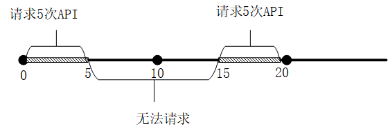

[toc]

Redis可以应用于多种场景 [^9][^10] 

# 计数器[^1]

**`incr`命令**

 Redis `incr `命令将 key 中储存的数字值增一。如果 key 不存在，那么 key 的值会先被初始化为 0 ，然后再执行`incr`操作。  如果值包含错误的类型，或字符串类型的值不能表示为数字，那么返回一个错误。 

**使用思路：** 每次有相关操作的时候，就向Redis服务器发送一个`incr`命令。
**使用场景：**我们有一个web应用，我们想记录每个用户每天访问这个网站的次数。web应用只需要通过拼接用户id和代表当前时间的字符串作为key，每次用户访问这个页面的时候对这个key执行一下`incr`命令。
**拓展：**

+  通过结合使用INCR和EXPIRE命令，可以实现一个只记录用户在指定间隔时间内的访问次数的计数器
+ 客户端可以通过GETSET命令获取当前计数器的值并且重置为0
+ 通过类似于DECR或者INCRBY等原子递增/递减的命令，可以根据用户的操作来增加或者减少某些值 比如在线游戏，需要对用户的游戏分数进行实时控制，分数可能增加也可能减少。

# 限流器[^2]

 限速器是一种可以限制某些操作执行速率的特殊场景。 传统的例子就是限制某个公共API的请求数目。  假设我们要解决如下问题：限制某个API每秒每个IP的请求次数不超过10次。


## 基于`setnx`实现限流

> **`set`命令的拓展指令** [^4] [^5]
>
> - `EX seconds` ： 将键的过期时间设置为 `seconds` 秒。 执行 `SET key value EX seconds` 的效果等同于执行 `SETEX key seconds value` 。
> - `PX milliseconds` ： 将键的过期时间设置为 `milliseconds` 毫秒。 执行 `SET key value PX milliseconds` 的效果等同于执行 `PSETEX key milliseconds value` 。
> - `NX` ： 只在键不存在时， 才对键进行设置操作。 执行 `SET key value NX` 的效果等同于执行 `SETNX key value` 。
> - `XX` ： 只在键已经存在时， 才对键进行设置操作。

**实现：** 为了实现单位时间内，限制请求的数量。使用`setnx`设置锁，同时也给锁设置过期时间。`setnx`和`expire`操作不是原子性的，会导致锁无法解开，出现死锁。使用`set`拓展指令和`Lua`脚本来实现设置key和过期时间操作的原子性。[^3]

**问题：** 无法对连续的时间段进行限制。比如限制1-10秒的请求，无法限制2-11秒的请求。但是如果需要统计N秒内的M个请求，那么我们的Redis中需要保持N个key等等问题

例如，一个API限定10秒内只能请求５次，０～５秒中请求满5次，15～20秒请求满５次。由于`setnx`对连续时间进行控制，所以即使5～15秒中请求数量没有达到5次，也无法进行API访问了。




具体实现代码较为直观，不贴出了。[^1]

## 基于`zset`实现限流

> `zset`是有序集合。有序集合和集合一样也是 string 类型元素的集合,且不允许重复的成员。不同的是每个元素都会关联一个 double 类型的分数。redis 正是通过分数来为集合中的成员进行从小到大的排序。集合是通过哈希表实现的，所以添加，删除，查找的复杂度都是$ O(1)$。
>
> `zadd key score member`将一个或者多个member以及score加入到有序集合中。

使用滑动窗口实现连续时间段的请求控制。即，上面也提到1-10怎么变成2-11。其实也就是起始值和末端值都各+1即可

**思路：**我们可以将请求添加到`zset`中，当每一次请求进来的时候，value保持唯一，可以用UUID生成，而score可以用当前时间戳表示，因为score我们可以用来计算当前时间戳之内有多少的请求数量。而`zset`数据结构也提供了`range`方法让我们可以很轻易的获取到2个时间戳内有多少请求

**缺点：**`zset`可以做到滑动窗口的效果，并且能保证每N秒内至多M个请求，缺点就是`zset`的数据结构会越来越大。

**具体实现如下：**

```java
public Response limitFlow(){
        Long currentTime = new Date().getTime();
        System.out.println(currentTime);
        if(redisTemplate.hasKey("limit")) {
            Integer count = redisTemplate.opsForZSet().rangeByScore("limit", currentTime -  intervalTime, currentTime).size();        // intervalTime是限流的时间 
            System.out.println(count);
            if (count != null && count > 5) {
                return Response.ok("每分钟最多只能访问5次");
            }
        }
        redisTemplate.opsForZSet().add("limit",UUID.randomUUID().toString(),currentTime);
        return Response.ok("访问成功");
    }
```

## 基于令牌桶算法限流

> **漏桶算法和令牌桶算法**[^6] [^7]
>
> **漏桶算法**中，将请求比作是水。用户发起请求就是向木桶中加水，服务器处理就是木桶放水。木桶放水存在一个最大的出水速率，当水来的的太猛且出水速度不够快时，会导致水溢出，也就是直接拒绝服务。
>
> **令牌桶算法**的原理是系统以恒定的速率产生令牌，然后把令牌放到令牌桶中，令牌桶有一个容量，当令牌桶满了的时候，再向其中放令牌，那么多余的令牌会被丢弃；当想要处理一个请求的时候，需要从令牌桶中取出一个令牌，如果此时令牌桶中没有令牌，那么则拒绝该请求。
>
> **令牌桶算法既能够限制数据的平均传输速率，还能允许某种程度的突发传输**

使用Redis中的List可以实现令牌桶算法[^7]。

```java
// 输出令牌
public Response limitFlow2(Long id){
    Object result = redisTemplate.opsForList().leftPop("limit_list");
    if(result == null){
        return Response.ok("当前令牌桶中无令牌");
    }
    return Response.ok(articleDescription2);
}
```

```java
// 10S的速率往令牌桶中添加UUID，只为保证唯一性
@Scheduled(fixedDelay = 10_000,initialDelay = 0)
public void setIntervalTimeTask(){
    redisTemplate.opsForList().rightPush("limit_list",UUID.randomUUID().toString());
}
```

# 缓存[^8] [^11]

将热点数据放在Redis中存储，Redis是基于内存的数据库，可以大幅提高请求响应的时间。同时使用`expire`设置过期时间以及设置淘汰策略来完成缓存的更新。

缓存应用的分类：

1. **页面缓存：** 用户第一次请求访问页面时，从数据库中读取数据，然后生成一个静态页面，并将其放入到Redis中，之后对页面的访问，只需要从Redis加载即可
2. **数据缓存：** 一个页面中的数据可能来自不同的缓存，此时不适合采用页面缓存，应该使用数据缓存。例如一个页面中包含普通商品和热卖商品，两种商品通常位于不同的缓存中。
3. **会话缓存：**可以使用 Redis 来统一存储多台应用服务器的会话信息。当应用服务器不再存储用户的会话信息，也就不再具有状态，一个用户可以请求任意一个应用服务器，从而更容易实现高可用性以及可伸缩性。

# 排行榜[^12]

使用Redis中的`zset`可以实现排行榜的功能。不同的是每个元素都会关联一个 `double `类型的分数。Redis正是通过分数来为集合中的成员进行从小到大的排序。

下面以游戏排行榜说明如何使用Redis完成排行榜的功能。`zset`中元素为玩家的ID，元素的分数为玩家的的分数[^13]。

1. **设置玩家分数。**`zadd 排行榜名称 分数 玩家标识` 时间复杂度：$O(log(N))$。如果玩家分数已经存在，则会覆盖之前的分数。
2. **查看玩家分数。**`zscore 排行榜名称 玩家标识 `时间复杂度：$O(1)$
3. **按名次查看排行榜。**`zrevrange 排行榜名称 起始位置 结束位置 [withscores] `时间复杂度：$O(log(N)+M)$。由于排行榜一般是按照分数**由高到低**排序的，所以我们使用`zrevrange`，而命令`zrange`是按照分数**由低到高**排序。起始位置和结束位置都是以0开始的索引，且都包含在内。**如果结束位置为-1则查看范围为整个排行榜。带上withscores则会返回玩家分数**。
4. **查看玩家的排名。**`zrevrank 排行榜名称 玩家标识` 时间复杂度：$O(log(N))$。与zrevrange类似，zrevrank是以分数由高到低的排序返回玩家排名（实际返回的是以0开始的索引），对应的zrank则是以分数由低到高的排序返回排名。
5. **增减玩家分数。**`zincrby 排行榜名称 分数增量 玩家标识`。时间复杂度：$O(log(N))$。有的排行榜是在变更时重新设置玩家的分数，而还有的排行榜则是以增量方式修改玩家分数，增量可正可负。如果执行``zincrby``时玩家尚不在排行榜中，则认为其原始分数为0，相当于执行`zadd`。
6. **移除某个玩家。**`zrem 排行榜名称 玩家标识` 时间复杂度：$O(log(N))$
7. **删除排行榜。**`del 排行榜名称`。

实现分数相同时，以更新时间为键来排序。

> 带时间戳的分数 = 实际分数*10000000000 + (9999999999 – timestamp)

# 分布式锁[^14]

> 在分布式系统中，同样的程序可能在多台机器上运行。但是，为了保证数据的一致性，在临界资源上，只能允许一个线程执行。协调线程执行的关键就是分布式锁。

使用`set`拓展指令来进行加锁，要保证加锁的原子性，防止出现死锁。

```java
public class RedisTool {

    private static final String LOCK_SUCCESS = "OK";
    private static final String SET_IF_NOT_EXIST = "NX";
    private static final String SET_WITH_EXPIRE_TIME = "PX";

    /**
     * 尝试获取分布式锁
     * @param jedis Redis客户端
     * @param lockKey 锁
     * @param requestId 请求标识
     * @param expireTime 超期时间
     * @return 是否获取成功
     */
    public static boolean tryGetDistributedLock(Jedis jedis, String lockKey, String requestId, int expireTime) {

        String result = jedis.set(lockKey, requestId, SET_IF_NOT_EXIST, SET_WITH_EXPIRE_TIME, expireTime);

        if (LOCK_SUCCESS.equals(result)) {
            return true;
        }
        return false;

    }
}
```

使用`Lua`脚本来实现解锁操作的原子性，防止客户端A加的锁，被其他客户端B误删。

# 延迟消息队列[^15]

任务发布后，需要经过一段时间才会执行。实现这样的功能，需要使用到延迟消息队列。这样的业务场景非常常见。对于红包场景，账户 A 对账户 B 发出红包通常在 1 天后会自动归还到原账户。对于实时支付场景，如果账户 A 对商户 S 付款 100 元，5秒后没有收到支付方回调将自动取消订单。

Redis使用`zset`，以延迟时间的时间戳为`score`，构建一个集合。设计一个Timer，轮询整个集合，将延迟时间大于等于当前时间的任务，添加到就绪队列中，等待处理。

**下面以排队取号系统为例子说明如何使用Redis完成延迟消息队列**

**用户的需求：**

- 在用户预约时间到达前XX分钟发短信通知
- 在用户预约时间结束时要判断用户是否去取号了，不然就记录为爽约
- 在用户取号后开始，等待XX分钟后要发短信提醒是否需要使用其他渠道办理

**整体结构：**

整个延迟队列由4个部分组成：

+ JobPool用来存放所有Job的元信息。利用redis的hash结构。
+ DelayBucket是一组以时间为维度的有序队列，用来存放所有需要延迟的Job（这里只存放Job Id）。利用redis 的 有序集合zset。
+ Timer负责实时扫描各个Bucket，并将delay时间大于等于当前时间的Job放入到对应的Ready Queue。利用redis 的list 结构
+ ReadyQueue存放处于Ready状态的Job（这里只存放JobId），以供消费程序消费。

**消息结构：**

+ topic：Job类型。可以理解成具体的业务名称。
+ id：Job的唯一标识。用来检索和删除指定的Job信息。
+ delayTime：jod延迟执行的时间，13位时间戳
+ ttr（time-to-run)：Job执行超时时间。单位：秒。主要是为了消息可靠性
+ message：Job的内容，供消费者做具体的业务处理，以json格式存储。

**举例说明一个Job的生命周期：**

1. 用户预约后，同时往JobPool里put一个job。job结构为：{‘topic':'book’, ‘id':'123456’, ‘delayTime’:1517069375398 ,’ttrTime':60 , ‘message':’XXXXXXX’}
    同时以jobId作为value，delayTime作为score 存到bucket 中，用jobId取模，放到10个bucket中，以提高效率
2. timer每时每刻都在轮询各个bucket，按照score排序去最小的一个，当delayTime < 当前时间后，，取得job id从job pool中获取元信息。
    如果这时该job处于deleted状态，则pass，继续做轮询；如果job处于非deleted状态，首先再次确认元信息中delayTime是否大于等于当前时间，
    如果满足则根据topic将jobId放入对应的ready queue，然后从bucket中移除,并且；如果不满足则重新计算delay时间，再次放入bucket，并将之前的job id从bucket中移除。
3. 消费端轮询对应的topic的ready queue，获取job后做自己的业务逻辑。与此同时，服务端将已经被消费端获取的job按照其设定的TTR，重新计算执行时间，并将其放入bucket。
    消费端处理完业务后向服务端响应finish，服务端根据job id删除对应的元信息。如果消费端在ttr时间内没有响应，则ttr时间后会再收到该消息

# 模糊查询和分页

> `SCAN` 命令及其相关的 `SSCAN` 命令、 `HSCAN` 命令和 `ZSCAN` 命令都用于增量地迭代（incrementally iterate）一集元素（a collection of elements）。
>
> - `SCAN` 命令用于迭代当前数据库中的数据库键。
> - `SSCAN` 命令用于迭代集合键中的元素。
> - `HSCAN` 命令用于迭代哈希键中的键值对。
> - `ZSCAN` 命令用于迭代有序集合中的元素（包括元素成员和元素分值）。
>
> 增量式迭代命令可以通过提供一个 glob 风格的模式参数， 让命令只返回和给定模式相匹配的元素， 这一点可以通过在执行增量式迭代命令时， 通过给定 `MATCH <pattern>` 参数来实现。[^16]

**模糊查询：**[^18]

使用`scan`命令结合`match` 参数，完成模糊匹配。

```java
 @Test
    public void testScan() {
        // 创建一个jedis的对象。
        Jedis jedis = new Jedis("192.168.112.65", 6379);
        jedis.auth("zhifu123");
        // 调用jedis对象的方法，方法名称和redis的命令一致。
        ScanParams scanParams = new ScanParams();
        scanParams.match("DL*");
        scanParams.count(5);
        jedis.select(1);
        // scan(curso,params) cursor 表示开始遍历的游标   params 是ScanParams 对象，此对象可以设置 每次返回的数量，以及遍历时的正则表达式
        // 需要注意的是，对元素的模式匹配工作是在命令从数据集中取出元素之后，向客户端返回元素之前的这段时间内进行的，
        //  所以如果被迭代的数据集中只有少量元素和模式相匹配，那么迭代命令或许会在多次执行中都不返回任何元素。  
        ScanResult<String> scan = jedis.scan("0", scanParams);
        System.out.println("scan：返回用于下次遍历的游标"+scan.getStringCursor());
        System.out.println("scan：返回结果"+scan.getResult());
        // 关闭jedis。
        jedis.close();
}
```

**分页**[^17]

利用ZSET及HASH结构存储数据实现redis分页。

1.  首先利用ZSET将表A中的id以value形式进行存储，以及利用ZSET中score进行排序处理；
2.  将表A中数据以HASH结构进行存储，id作为HASH中key；
3.  利用redis中的zRangeByScore进行ZSET分页取出id列表，然后即可取出HASH中分页后的数据。

# 布隆过滤器

## 布隆过滤器简介

**作用：**布隆过滤器应用于准确快速判断某个数据是否存在于大量的数据集合中。

**结构：** 布隆过滤器由一串很长的二进制向量组成的数据结构，可以将其看成一个二进制数组。初始默认值都是0。

**添加数据：** 当要向布隆过滤器中添加一个元素key时，我们通过多个hash函数，算出一个值，这个值作为二进制数组的下标，将二进制数组中该下标所在的元素置为1。

**判断数据是否存在？** 我们只需要将这个新的数据通过上面自定义的几个哈希函数，分别算出各个值，然后看其对应的地方是否==**都是1**==

+ 如果存在一个不是1的情况，那么我们可以说，该新数据一定不存在于这个布隆过滤器中。
+ 如果通过哈希函数算出来的值，对应的地方都是1。这个数据不一定存在于布隆过滤器中。如果通过哈希函数算出来的值，对应的地方都是1

**布隆过滤器可以判断某个数据一定不存在，但是无法判断一定存在**

**优缺点：** 
**优点：**优点很明显，二进制组成的数组，占用内存极少，并且插入和查询速度都足够快。
**缺点：**随着数据的增加，误判率会增加；还有无法判断数据一定存在；另外还有一个重要缺点，无法删除数据。

Redis中提供一系列位操作`setbit`,`getbit`,`bitcount`

> `setbit` 对 `key` 所储存的字符串值，设置或清除指定偏移量上的位(bit)。
> `getbit` 对 `key` 所储存的字符串值，获取指定偏移量上的位(bit)。
> `bitcount` 计算给定字符串中，被设置为 `1` 的比特位的数量。

## 实现

Redission和Guava两个库都可以实现布隆过滤器

**通过 Redisson 来构造布隆过滤器。**

```java
package com.ys.rediscluster.bloomfilter.redisson;

import org.redisson.Redisson;
import org.redisson.api.RBloomFilter;
import org.redisson.api.RedissonClient;
import org.redisson.config.Config;

public class RedissonBloomFilter {

    public static void main(String[] args) {
        Config config = new Config();
        config.useSingleServer().setAddress("redis://192.168.14.104:6379");
        config.useSingleServer().setPassword("123");
        //构造Redisson
        RedissonClient redisson = Redisson.create(config);

        RBloomFilter<String> bloomFilter = redisson.getBloomFilter("phoneList");
        //初始化布隆过滤器：预计元素为100000000L,误差率为3%
        bloomFilter.tryInit(100000000L,0.03);
        //将号码10086插入到布隆过滤器中
        bloomFilter.add("10086");

        //判断下面号码是否在布隆过滤器中
        System.out.println(bloomFilter.contains("123456"));//false
        System.out.println(bloomFilter.contains("10086"));//true
    }
}
```

**gava是谷歌提供的工具包不通过Redis布隆过滤器**

```java
package com.ys.rediscluster.bloomfilter;

import com.google.common.base.Charsets;
import com.google.common.hash.BloomFilter;
import com.google.common.hash.Funnel;
import com.google.common.hash.Funnels;

public class GuavaBloomFilter {
    public static void main(String[] args) {
        BloomFilter<String> bloomFilter = BloomFilter.create(Funnels.stringFunnel(Charsets.UTF_8),100000,0.01);

        bloomFilter.put("10086");

        System.out.println(bloomFilter.mightContain("123456"));
        System.out.println(bloomFilter.mightContain("10086"));
    }
}
```


# 参考资料

[^1]: [Redis原子计数器incr，防止并发请求](https://cloud.tencent.com/developer/article/1376410)
[^2]: [Redis 实现限流的三种方式 ](https://blog.csdn.net/lmx125254/article/details/90700118)
[^3]: [RedisTemplate下Redis分布式锁引发的系列问题 ](https://blog.csdn.net/lmx125254/article/details/89604638)
[^4]:[Redis set 指令 —–官方文档](https://redis.io/commands/set)
[^5]: [Redis set 指令 中文文档](http://redisdoc.com/string/set.html)
[^6]:[接口限流算法：漏桶算法&令牌桶算法](https://segmentfault.com/a/1190000015967922)
[^7]:[高并发系统限流-漏桶算法和令牌桶算法](https://www.cnblogs.com/xuwc/p/9123078.html)
[^8]:《Redis实战》第二章
[^9]:[Redis常见应用场景](https://www.jianshu.com/p/40dbc78711c8)
[^10]:[redis使用场景及案例](https://blog.csdn.net/Bobdragery/article/details/99711762)
[^11]:[使用Redis做MySQL的缓存](https://blog.csdn.net/songjianyue12345/article/details/78587053)
[^12]:[Redis实现排行榜功能(实战)](https://blog.csdn.net/m0_37459380/article/details/82971525)
[^13]:[使用Redis实现实时排行榜 ](https://blog.csdn.net/igo9go_zq/article/details/79567121)
[^14]:[Redis分布式锁的正确实现方式](https://www.cnblogs.com/linjiqin/p/8003838.html)
[^15]:[基于redis实现的延迟消息队列 ](https://www.jianshu.com/p/e958e8590020)
[^16]:[scan Redis中文文档](http://redisdoc.com/database/scan.html)
[^17]:[Redis模糊查询以及分页 ](https://blog.csdn.net/m0_46506160/article/details/109380008)
[^18]:[Redis命令：scan实现模糊查询 ](https://blog.csdn.net/fly910905/article/details/78942357)